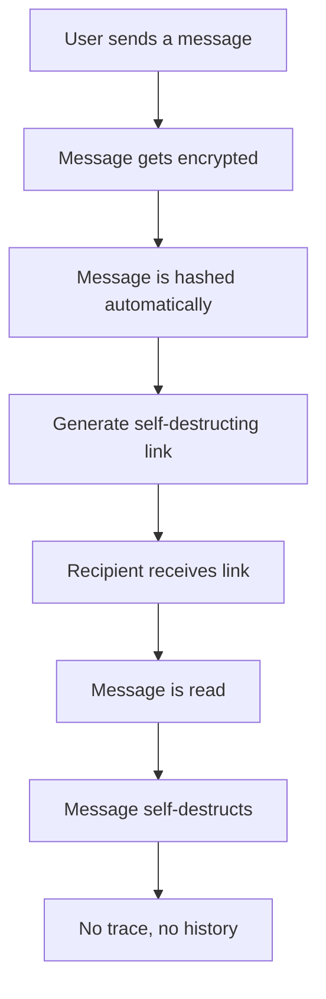
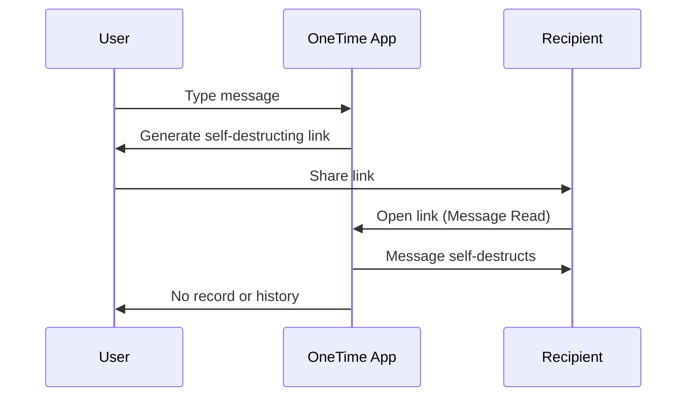

# OneTime – Secure Self-Destructing Messages

OneTime is a minimalist, privacy-first web app for sending secret messages via self-destructing links. **No history, no traces.** Secure, simple, and one-time only. If privacy is your priority, then OneTime is the solution you’ve been waiting for.


## Table of Contents

- [Features](#features)
- [How It Works](#how-it-works)
- [Tech Stack](#tech-stack)
- [Installation](#installation)
- [Usage](#usage)
- [Contributing](#contributing)
- [License](#license)

## Features

- **Self-Destructing Messages**: Messages disappear after being viewed, leaving no trace.
- **End-to-End Encryption**: Your messages are securely encrypted and can only be viewed by the intended recipient.
- **One-Time Use Only**: Each message can only be opened once; no second chances.
- **Automatic Hashing**: All messages are automatically hashed before storage to ensure that even if a message is intercepted, it cannot be read or reconstructed.
- **Privacy-Focused**: No data is stored after message destruction.
- **No History, No Traces**: Your communication is as ephemeral as your privacy.
- **Secure Communication**: A safe way to share sensitive information without leaving a digital footprint.

## How It Works


1. **Send a Secure Message**: Type your message, and OneTime will generate an encrypted link.
2. **Message Hashing**: Before the message is stored, it is hashed to protect its confidentiality.
3. **One-Time Link**: Send the generated link to your recipient.
4. **Message Self-Destructs**: Once the recipient views the message, it disappears forever. No record, no trace.

It's that simple. No login, no accounts, no history.

## GIF Showcase: How Hashing Works

Below is a GIF showcasing how the message is hashed before it is sent:


In this example, you can see how your message is converted into a secure hash, ensuring that no one can decrypt or read it.

## Tech Stack

OneTime is built using the latest technologies to ensure that it remains fast, secure, and scalable:

- **Frontend**: React.js, HTML5, CSS3, Tailwind CSS
- **Backend**: Node.js, Express
- **Encryption**: AES-256 Encryption (for message confidentiality)
- **Hashing**: HS-256 (for hashing message content before storing)
- **Hosting**: Vercel

## Installation

To get started locally, clone this repository and set up the application:

```bash
git clone https://github.com/Echoinbyte/onetime.git
cd onetime
npm install
npm start
```
You can now access the app at http://localhost:3000.

## Usage
### Steps to Use OneTime

1. Go to the OneTime App.
2. Type your confidential message.

3. Click "Generate Link."

4. Share the link with your recipient.

5. Watch as your message self-destructs after being read.

That's it! One-time communication, fully encrypted, and privacy-first.

## Contributing
We welcome contributions to make OneTime even better! If you'd like to contribute, follow these steps:

1. Fork the repository.

2. Create a new branch (git checkout -b feature/your-feature).

3. Make your changes and commit them (git commit -am 'Add new feature').

4. Push to the branch (git push origin feature/your-feature).

5. Open a pull request.

Please make sure to write tests and keep the codebase clean and readable.

## License
OneTime is licensed under the MIT License. See the LICENSE file for more details.

## Conclusion
If you value privacy and simplicity, OneTime is your go-to solution for secure and confidential communication.